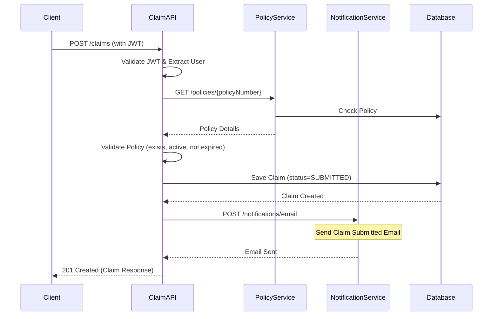

# Insurance Claim System - Architecture Overview

## Project Structure

```
insurance-demo/
├── claim-api/                    # Claim Service (Spring Boot)
├── policy-service/               # Policy Service (Spring Boot)
├── notification-service/         # Notification Service (Spring Boot)
├── react-web/                    # React Web Application
├── react-native-mobile/          # React Native Mobile Application
├── docker-compose.yml            # Docker Compose Configuration
└── README.md                     # Project Documentation
```

## Microservices Architecture

```
┌─────────────────────────────────────────────────────────────────────────────┐
│                              Client Layer                                   │
├──────────────────────────────────┬────────────────────────────────────────┤
│         React Web                │         React Native Mobile            │
│    http://localhost:3000         │         http://localhost:8081          │
└──────────────────────────────────┴────────────────────────────────────────┘
                                      │
                                      ▼
┌─────────────────────────────────────────────────────────────────────────────┐
│                           API Gateway (Optional)                            │
└─────────────────────────────────────────────────────────────────────────────┘
                                      │
         ┌────────────────────────────┼────────────────────────────┐
         ▼                            ▼                            ▼
┌─────────────────┐         ┌─────────────────┐         ┌─────────────────┐
│   Claim API     │         │  Policy Service │         │Notification Svc │
│  :8082          │         │    :8083        │         │    :8084        │
└────────┬────────┘         └────────┬────────┘         └────────┬────────┘
         │                           │                           │
         │    ┌─────────────────────┘                           │
         │    │                   Service Communication         │
         │    ▼                   (OpenFeign)                   │
         │    ┌─────────────────────────────────────────────────┐│
         │    │           PostgreSQL (:5432)                   ││
         │    │  ┌──────────┐ ┌──────────┐ ┌────────────────┐  ││
         │    │  │claim_api │ │ policy_  │ │notification_   │  ││
         │    │  │_db       │ │ service_ │ │service_db      │  ││
         │    │  │          │ │ db       │ │                │  ││
         │    │  └──────────┘ └──────────┘ └────────────────┘  ││
         │    └─────────────────────────────────────────────────┘│
         │                           │                           │
         └───────────────────────────┴───────────────────────────┘
```

## Technology Stack

### Backend
- **Java 21**
- **Spring Boot 3.2.x**
- **Spring Security + JWT**
- **Spring Data JPA**
- **PostgreSQL**
- **Maven**
- **OpenAPI/Swagger**
- **Docker**
- **Lombok**
- **MapStruct**
- **OpenFeign**

### Frontend (Web)
- **React 18**
- **TypeScript**
- **React Router v6**
- **Axios**
- **Material UI v5**

### Mobile
- **React Native**
- **TypeScript**
- **React Navigation**
- **Axios**
- **AsyncStorage**

## Database Design

### ER Diagram

```
┌─────────────┐       ┌─────────────┐       ┌─────────────┐
│    roles    │       │    users    │       │    claims   │
├─────────────┤       ├─────────────┤       ├─────────────┤
│ id (PK)     │◄──┐   │ id (PK)     │       │ id (PK)     │
│ name        │   │   │ username    │       │ policy_number│
└─────────────┘   │   │ password    │       │ claim_type   │
      │           │   │ email       │       │ incident_date│
      │           │   │ full_name   │       │ description  │
      │           │   │ phone       │       │ amount       │
      │           │   │ role_id (FK)│──────►│ status       │
      │           │   └─────────────┘       │ submitted_by │
      │           │                         │ created_at   │
      │           │                         │ updated_at   │
      │           │                         └──────┬───────┘
      │           │                                │
      │           │       ┌───────────────────────┘
      │           │       │
      ▼           ▼       ▼
┌─────────────────────────────┐       ┌─────────────────────────┐
│        policies             │       │    claim_attachments    │
├─────────────────────────────┤       ├─────────────────────────┤
│ policy_number (PK)          │       │ id (PK)                 │
│ customer_name               │       │ claim_id (FK)           │
│ customer_id (FK)            │◄──────│ file_name               │
│ policy_status               │       │ file_path              │
│ coverage                    │       │ file_type              │
│ premium                     │       │ uploaded_at            │
│ start_date                  │       └─────────────────────────┘
│ expiry_date                 │
└─────────────────────────────┘

┌─────────────────────────────┐
│       notifications         │
├─────────────────────────────┤
│ id (PK)                     │
│ user_id (FK)                │
│ claim_id (FK)               │
│ type                        │
│ subject                     │
│ message                     │
│ sent_at                     │
│ read                        │
└─────────────────────────────┘
```

## API Endpoints Summary

### Claim API (:8082)
- `POST /auth/login` - User login
- `POST /auth/register` - User registration
- `GET /claims` - List all claims (Admin/Adjuster)
- `GET /claims/my` - List user's claims
- `GET /claims/{id}` - Get claim details
- `POST /claims` - Submit new claim
- `PUT /claims/{id}/status` - Update claim status
- `GET /policies/{policyNumber}` - Validate policy (calls Policy Service)

### Policy Service (:8083)
- `GET /policies/{policyNumber}` - Get policy details
- `GET /policies` - List all policies

### Notification Service (:8084)
- `POST /notifications/email` - Send email notification
- `GET /notifications` - Get user notifications

## Security

### JWT Authentication Flow
```
1. User sends credentials to /auth/login
2. Server validates credentials
3. Server generates JWT token with user info and roles
4. Client stores JWT in localStorage/AsyncStorage
5. Client sends JWT in Authorization header for subsequent requests
6. Server validates JWT and extracts user info
```

### Role-Based Access Control
- **CUSTOMER**: Submit claims, view own claims, view own profile
- **ADJUSTER**: View all claims, update claim status, view claim details
- **ADMIN**: Full access to all resources

## Sequence Diagram - Submit Claim



## Docker Services

| Service | Port | Description |
|---------|------|-------------|
| postgres | 5432 | Database |
| claim-api | 8082 | Claim Service API |
| policy-service | 8083 | Policy Service |
| notification-service | 8084 | Notification Service |
| react-web | 3000 | React Web App |

## Getting Started

See README.md for detailed instructions on:
1. Prerequisites
2. Environment Setup
3. Running with Docker
4. Running Locally
5. API Documentation
6. Testing

## Chapters

This project will be generated in the following order:

1. **Chapter 1**: PostgreSQL Schema & ER Diagram
2. **Chapter 2**: Spring Boot Claim API
3. **Chapter 3**: Security (JWT)
4. **Chapter 4**: Policy Service
5. **Chapter 5**: Notification Service
6. **Chapter 6**: React Web
7. **Chapter 7**: React Native Mobile
8. **Chapter 8**: Docker Compose
9. **Chapter 9**: Unit Tests
10. **Chapter 10**: Integration Tests
11. **Chapter 11**: README
