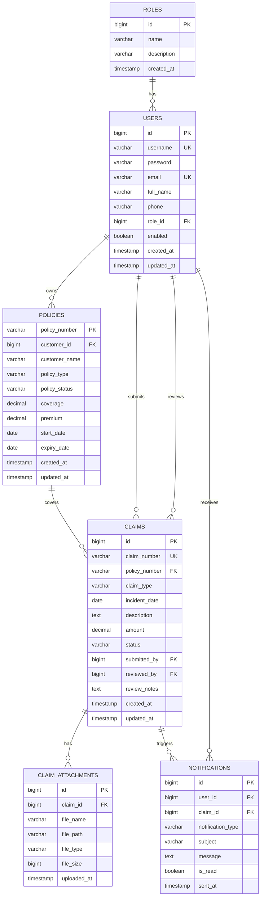
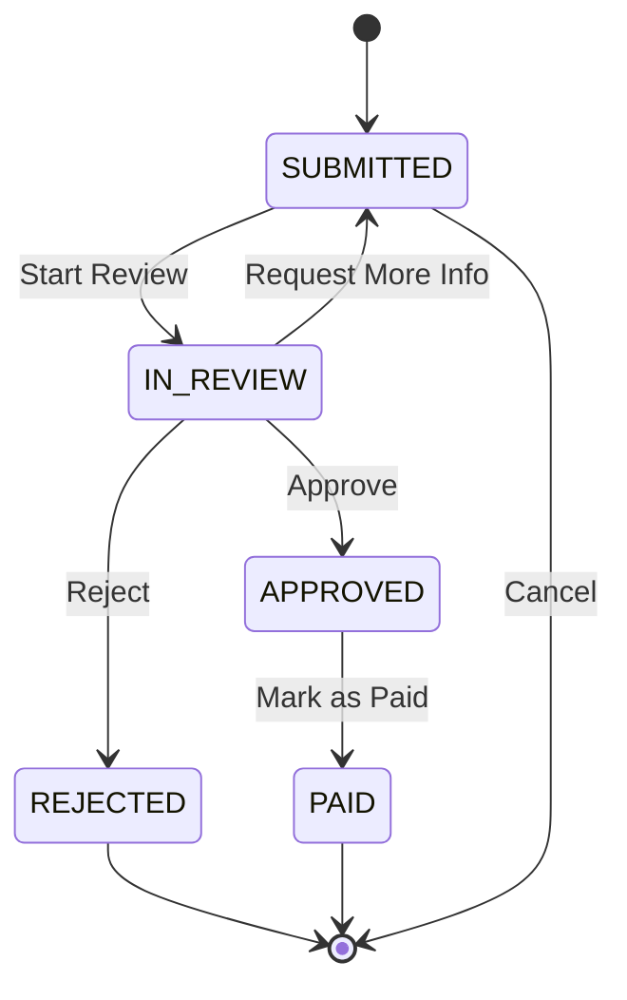

# Chapter 1: PostgreSQL Schema

## Database Creation

```sql
-- Create Database
CREATE DATABASE insurance_claim_db;
```

## Schema SQL

```sql
-- =====================================================
-- Insurance Claim System - PostgreSQL Schema
-- =====================================================

-- Drop tables if exist (for clean setup)
DROP TABLE IF EXISTS claim_attachments CASCADE;
DROP TABLE IF EXISTS notifications CASCADE;
DROP TABLE IF EXISTS claims CASCADE;
DROP TABLE IF EXISTS policies CASCADE;
DROP TABLE IF EXISTS users CASCADE;
DROP TABLE IF EXISTS roles CASCADE;

-- =====================================================
-- ROLES TABLE
-- =====================================================
CREATE TABLE roles (
    id BIGSERIAL PRIMARY KEY,
    name VARCHAR(50) NOT NULL UNIQUE,
    description VARCHAR(255),
    created_at TIMESTAMP DEFAULT CURRENT_TIMESTAMP
);

-- =====================================================
-- USERS TABLE
-- =====================================================
CREATE TABLE users (
    id BIGSERIAL PRIMARY KEY,
    username VARCHAR(100) NOT NULL UNIQUE,
    password VARCHAR(255) NOT NULL,
    email VARCHAR(255) NOT NULL UNIQUE,
    full_name VARCHAR(255) NOT NULL,
    phone VARCHAR(20),
    role_id BIGINT NOT NULL REFERENCES roles(id),
    enabled BOOLEAN DEFAULT TRUE,
    created_at TIMESTAMP DEFAULT CURRENT_TIMESTAMP,
    updated_at TIMESTAMP DEFAULT CURRENT_TIMESTAMP
);

-- =====================================================
-- POLICIES TABLE
-- =====================================================
CREATE TABLE policies (
    policy_number VARCHAR(50) PRIMARY KEY,
    customer_id BIGINT NOT NULL REFERENCES users(id),
    customer_name VARCHAR(255) NOT NULL,
    policy_type VARCHAR(50) NOT NULL,
    policy_status VARCHAR(20) NOT NULL DEFAULT 'ACTIVE',
    coverage DECIMAL(15,2) NOT NULL,
    premium DECIMAL(10,2) NOT NULL,
    start_date DATE NOT NULL,
    expiry_date DATE NOT NULL,
    created_at TIMESTAMP DEFAULT CURRENT_TIMESTAMP,
    updated_at TIMESTAMP DEFAULT CURRENT_TIMESTAMP
);

-- =====================================================
-- CLAIMS TABLE
-- =====================================================
CREATE TABLE claims (
    id BIGSERIAL PRIMARY KEY,
    claim_number VARCHAR(50) NOT NULL UNIQUE,
    policy_number VARCHAR(50) NOT NULL REFERENCES policies(policy_number),
    claim_type VARCHAR(50) NOT NULL,
    incident_date DATE NOT NULL,
    description TEXT NOT NULL,
    amount DECIMAL(15,2) NOT NULL,
    status VARCHAR(20) NOT NULL DEFAULT 'SUBMITTED',
    submitted_by BIGINT NOT NULL REFERENCES users(id),
    reviewed_by BIGINT REFERENCES users(id),
    review_notes TEXT,
    created_at TIMESTAMP DEFAULT CURRENT_TIMESTAMP,
    updated_at TIMESTAMP DEFAULT CURRENT_TIMESTAMP
);

-- =====================================================
-- CLAIM ATTACHMENTS TABLE
-- =====================================================
CREATE TABLE claim_attachments (
    id BIGSERIAL PRIMARY KEY,
    claim_id BIGINT NOT NULL REFERENCES claims(id) ON DELETE CASCADE,
    file_name VARCHAR(255) NOT NULL,
    file_path VARCHAR(500) NOT NULL,
    file_type VARCHAR(50),
    file_size BIGINT,
    uploaded_at TIMESTAMP DEFAULT CURRENT_TIMESTAMP
);

-- =====================================================
-- NOTIFICATIONS TABLE
-- =====================================================
CREATE TABLE notifications (
    id BIGSERIAL PRIMARY KEY,
    user_id BIGINT NOT NULL REFERENCES users(id),
    claim_id BIGINT REFERENCES claims(id),
    notification_type VARCHAR(50) NOT NULL,
    subject VARCHAR(255) NOT NULL,
    message TEXT NOT NULL,
    is_read BOOLEAN DEFAULT FALSE,
    sent_at TIMESTAMP DEFAULT CURRENT_TIMESTAMP
);

-- =====================================================
-- INDEXES
-- =====================================================

-- Users indexes
CREATE INDEX idx_users_username ON users(username);
CREATE INDEX idx_users_email ON users(email);
CREATE INDEX idx_users_role_id ON users(role_id);

-- Policies indexes
CREATE INDEX idx_policies_customer_id ON policies(customer_id);
CREATE INDEX idx_policies_status ON policies(policy_status);
CREATE INDEX idx_policies_expiry_date ON policies(expiry_date);

-- Claims indexes
CREATE INDEX idx_claims_policy_number ON claims(policy_number);
CREATE INDEX idx_claims_status ON claims(status);
CREATE INDEX idx_claims_submitted_by ON claims(submitted_by);
CREATE INDEX idx_claims_reviewed_by ON claims(reviewed_by);
CREATE INDEX idx_claims_created_at ON claims(created_at);
CREATE INDEX idx_claims_incident_date ON claims(incident_date);

-- Claim Attachments indexes
CREATE INDEX idx_claim_attachments_claim_id ON claim_attachments(claim_id);

-- Notifications indexes
CREATE INDEX idx_notifications_user_id ON notifications(user_id);
CREATE INDEX idx_notifications_claim_id ON notifications(claim_id);
CREATE INDEX idx_notifications_is_read ON notifications(is_read);
CREATE INDEX idx_notifications_sent_at ON notifications(sent_at);

-- =====================================================
-- SAMPLE DATA - ROLES
-- =====================================================
INSERT INTO roles (name, description) VALUES
('CUSTOMER', 'Insurance customer who can submit and view claims'),
('ADJUSTER', 'Insurance adjuster who reviews and processes claims'),
('ADMIN', 'System administrator with full access');

-- =====================================================
-- SAMPLE DATA - USERS (password: password123 - BCrypt encoded)
-- =====================================================
INSERT INTO users (username, password, email, full_name, phone, role_id) VALUES
-- Customer
('john.doe', '$2a$10$N9qo8uLOickgx2ZMRZoMyeIjZRGdjGj/n3.rCQJxaRFTtMFj/HbZe', 'john.doe@email.com', 'John Doe', '+1-555-0101', 1),
('jane.smith', '$2a$10$N9qo8uLOickgx2ZMRZoMyeIjZRGdjGj/n3.rCQJxaRFTtMFj/HbZe', 'jane.smith@email.com', 'Jane Smith', '+1-555-0102', 1),
-- Adjuster
('mike.johnson', '$2a$10$N9qo8uLOickgx2ZMRZoMyeIjZRGdjGj/n3.rCQJxaRFTtMFj/HbZe', 'mike.johnson@insurance.com', 'Mike Johnson', '+1-555-0201', 2),
('sarah.wilson', '$2a$10$N9qo8uLOickgx2ZMRZoMyeIjZRGdjGj/n3.rCQJxaRFTtMFj/HbZe', 'sarah.wilson@insurance.com', 'Sarah Wilson', '+1-555-0202', 2),
-- Admin
('admin', '$2a$10$N9qo8uLOickgx2ZMRZoMyeIjZRGdjGj/n3.rCQJxaRFTtMFj/HbZe', 'admin@insurance.com', 'System Admin', '+1-555-0301', 3);

-- =====================================================
-- SAMPLE DATA - POLICIES
-- =====================================================
INSERT INTO policies (policy_number, customer_id, customer_name, policy_type, policy_status, coverage, premium, start_date, expiry_date) VALUES
('POL-001', 1, 'John Doe', 'HEALTH', 'ACTIVE', 100000.00, 500.00, '2024-01-01', '2025-12-31'),
('POL-002', 1, 'John Doe', 'AUTO', 'ACTIVE', 50000.00, 300.00, '2024-03-15', '2025-03-14'),
('POL-003', 2, 'Jane Smith', 'HOME', 'ACTIVE', 250000.00, 800.00, '2024-02-01', '2026-01-31'),
('POL-004', 2, 'Jane Smith', 'HEALTH', 'EXPIRED', 100000.00, 450.00, '2023-01-01', '2023-12-31'),
('POL-005', 1, 'John Doe', 'LIFE', 'ACTIVE', 500000.00, 200.00, '2024-06-01', '2025-05-31');

-- =====================================================
-- SAMPLE DATA - CLAIMS
-- =====================================================
INSERT INTO claims (claim_number, policy_number, claim_type, incident_date, description, amount, status, submitted_by, reviewed_by, review_notes) VALUES
('CLM-2024-001', 'POL-001', 'HEALTH', '2024-06-15', 'Hospitalization due to accident', 15000.00, 'APPROVED', 1, 3, 'Verified with hospital records. Approved for payment.'),
('CLM-2024-002', 'POL-002', 'AUTO', '2024-07-20', 'Car accident at intersection', 8500.00, 'IN_REVIEW', 1, 4, 'Awaiting police report.'),
('CLM-2024-003', 'POL-003', 'HOME', '2024-08-05', 'Water damage from burst pipe', 12000.00, 'SUBMITTED', 2, NULL, NULL),
('CLM-2024-004', 'POL-001', 'HEALTH', '2024-05-10', 'Routine medical checkup', 500.00, 'REJECTED', 1, 3, 'Routine checkups not covered under this policy.'),
('CLM-2024-005', 'POL-003', 'HOME', '2024-04-12', 'Theft of electronics', 3500.00, 'PAID', 2, 4, 'Police report verified. Payment processed.');

-- =====================================================
-- SAMPLE DATA - CLAIM ATTACHMENTS
-- =====================================================
INSERT INTO claim_attachments (claim_id, file_name, file_path, file_type, file_size) VALUES
(1, 'hospital_report.pdf', '/attachments/clm-2024-001/hospital_report.pdf', 'application/pdf', 1024000),
(1, 'medical_bills.pdf', '/attachments/clm-2024-001/medical_bills.pdf', 'application/pdf', 512000),
(2, 'accident_photos.zip', '/attachments/clm-2024-002/accident_photos.zip', 'application/zip', 5120000),
(3, 'water_damage_photos.jpg', '/attachments/clm-2024-003/water_damage_photos.jpg', 'image/jpeg', 2048000),
(5, 'police_report.pdf', '/attachments/clm-2024-005/police_report.pdf', 'application/pdf', 768000);

-- =====================================================
-- SAMPLE DATA - NOTIFICATIONS
-- =====================================================
INSERT INTO notifications (user_id, claim_id, notification_type, subject, message, is_read, sent_at) VALUES
(1, 1, 'EMAIL', 'Claim Approved - CLM-2024-001', 'Your claim CLM-2024-001 has been approved for $15,000.00', TRUE, '2024-08-01 10:30:00'),
(1, 2, 'EMAIL', 'Claim Under Review - CLM-2024-002', 'Your claim CLM-2024-002 is currently under review.', TRUE, '2024-08-02 14:15:00'),
(1, 4, 'EMAIL', 'Claim Rejected - CLM-2024-004', 'Your claim CLM-2024-004 has been rejected.', TRUE, '2024-07-15 09:00:00'),
(2, 3, 'EMAIL', 'Claim Submitted - CLM-2024-003', 'Your claim CLM-2024-003 has been submitted successfully.', TRUE, '2024-08-06 11:00:00'),
(2, 5, 'EMAIL', 'Claim Paid - CLM-2024-005', 'Your claim CLM-2024-005 payment of $3,500.00 has been processed.', TRUE, '2024-07-20 16:30:00'),
(1, NULL, 'EMAIL', 'System Notification', 'Welcome to Insurance Claim System!', FALSE, '2024-06-01 08:00:00');

-- =====================================================
-- VIEWS FOR COMMON QUERIES
-- =====================================================

-- View: Claim Summary with User and Policy Details
CREATE VIEW v_claim_summary AS
SELECT
    c.id,
    c.claim_number,
    c.claim_type,
    c.incident_date,
    c.description,
    c.amount,
    c.status,
    c.created_at,
    u.full_name AS submitted_by_name,
    u.email AS submitted_by_email,
    p.policy_number,
    p.policy_type,
    p.coverage
FROM claims c
JOIN users u ON c.submitted_by = u.id
JOIN policies p ON c.policy_number = p.policy_number;

-- View: Claims Statistics by Status
CREATE VIEW v_claims_stats AS
SELECT
    status,
    COUNT(*) AS total_claims,
    SUM(amount) AS total_amount,
    AVG(amount) AS avg_amount
FROM claims
GROUP BY status;

-- View: Active Policies with Customer Info
CREATE VIEW v_active_policies AS
SELECT
    p.policy_number,
    p.customer_name,
    p.policy_type,
    p.policy_status,
    p.coverage,
    p.expiry_date,
    u.email,
    u.phone
FROM policies p
JOIN users u ON p.customer_id = u.id
WHERE p.policy_status = 'ACTIVE';

-- =====================================================
-- FUNCTIONS/TRIGGERS
-- =====================================================

-- Function to update updated_at timestamp
CREATE OR REPLACE FUNCTION update_updated_at_column()
RETURNS TRIGGER AS $$
BEGIN
    NEW.updated_at = CURRENT_TIMESTAMP;
    RETURN NEW;
END;
$$ language 'plpgsql';

-- Triggers for updated_at
CREATE TRIGGER update_users_updated_at BEFORE UPDATE ON users
    FOR EACH ROW EXECUTE FUNCTION update_updated_at_column();

CREATE TRIGGER update_policies_updated_at BEFORE UPDATE ON policies
    FOR EACH ROW EXECUTE FUNCTION update_updated_at_column();

CREATE TRIGGER update_claims_updated_at BEFORE UPDATE ON claims
    FOR EACH ROW EXECUTE FUNCTION update_updated_at_column();
```

## Entity Relationship Diagram (Mermaid)



## Claim Status Flow


